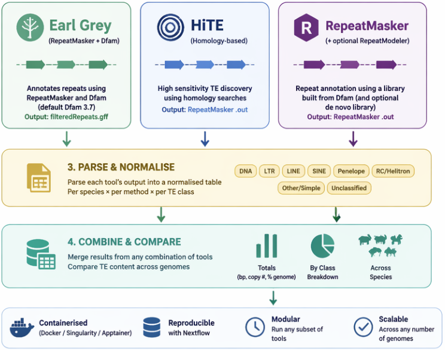

# CompareTE
A pipeline to compare TE content across genomes using various platforms.



# Requirements

Requires Nextflow >=26.04.

# Input

Input should be a csv file (ending in `.csv`). 

It should contain either:

```
name,refseqID
name,/full/path/to/genome.fa 
name,/full/path/to/genome.fa,/full/path/to/annotation.gff
```

**!! Do not use relative paths !!**

The genome must end with:

`'.fa', '.fasta', '.fna', '.fa.gz', '.fasta.gz', '.fna.gz'`

The annotation must end with:

`'.gff', '.gff3', '.gff.gz', '.gff3.gz'`

See examples in `conf/test` (various example in config files)

# Running the pipeline

To run the pipeline you need to make a csv input file as described above with either Refseq IDs (these always begin GCF_...), or with genomes, or genomes and annotation files.

To run with all the different TE programs on a input csv file called `input.csv`:

`nextflow run main.nf --orthofinder --hite --earlgrey --input input.csv`

**Though,** the above would require you to manually download all the prerequisites and programs, so the easier way is to set a container engine to pull all the programs you need:

`nextflow run main.nf --orthofinder --hite --earlgrey --input input.csv -profile docker/singularity/apptainer`

## Earl Grey and the Dfam database (`--famdb`)

Earl Grey runs from the `tobybaril/earlgrey_dfam3.7` container, which already ships a fully-configured RepeatMasker with Dfam 3.7. So in most cases you just run:

`nextflow run main.nf --earlgrey --input input.csv -profile singularity`

If you want to use a **newer Dfam release**, pass `--famdb` pointing at a directory containing the famdb partitions (e.g. `dfam39_full.N.h5` files):

`nextflow run main.nf --earlgrey --famdb /path/to/dfam39 --input input.csv -profile singularity`

`--famdb` is bind-mounted into the container at `/opt/conda/share/RepeatMasker/Libraries/famdb`, overriding the bundled Dfam. Note this replaces only the famdb, not the container's prebuilt RepeatMasker library, so a mismatched Dfam version may cause issues — the bundled Dfam 3.7 is the safest default.

## RepeatMasker / RepeatModeler (`--repeatmasker`)

An optional subworkflow annotates TEs with RepeatMasker, using a repeat library built from your `--famdb` Dfam database (via `famdb.py`). Optionally, `--run_repeatmodeler` first builds a de novo library per genome (slow) and merges it with the Dfam library. The library is de-duplicated with a clustering tool before masking.

`nextflow run main.nf --repeatmasker --famdb /path/to/dfam39 --input input.csv -profile singularity`

Options:

- `--run_repeatmodeler` — also build a de novo library with RepeatModeler (adds substantial runtime per genome).
- `--te_clusterer` — `linclust` (default), `mmseqs`, or `cdhit`.
- `--repeatmasker_speed` — `qq` (fastest, default), `q`, or `default` (most sensitive).
- `--famdb_lineage` — lineage to extract from the famdb (e.g. `hymenoptera`); defaults to `root`.

Outputs (masked genome, `.out`, `.tbl`, `.gff`, the repeat library, and a combined `.tsv`) are written to `results/repeatmasker/`.

## Combining TE methods (`PARSE_TE` / `COMBINE_TE`)

Whenever one or more TE methods are run (`--earlgrey`, `--hite`, `--repeatmasker`), the pipeline parses each method's output into a normalised per-species, per-method table (`PARSE_TE`) and then merges everything into combined outputs (`COMBINE_TE`). It reads Earl Grey's `filteredRepeats.gff`, HiTE's RepeatMasker `.out`, and RepeatMasker's `.out`, mapping all of them to common high-level TE classes (DNA, LTR, LINE, SINE, Penelope, RC/Helitron, Other/Simple, Unclassified).

This works for **any subset** of methods — one, two, or all three. Outputs in `results/compare_te/`:

- `combined_te_totals.tsv` — total TE bp, copy number, and % genome for every species × method.
- `combined_te_by_class.tsv` — per-class breakdown for every species × method.
- `combined_te_comparison.pdf` — a cross-species totals bar chart (coloured by method) and a per-class figure faceted by species.

`nextflow run main.nf --earlgrey --hite --repeatmasker --famdb ... --input input.csv -profile singularity`

## HPC cluster profiles

Bundled institutional profiles configure the scheduler, container engine, and resource limits for a specific cluster. They already enable the right container engine, so you do **not** need to add `-profile singularity` or an external `-c` config.

| Profile | Cluster | Scheduler | Container |
| --- | --- | --- | --- |
| `ucl_myriad` | UCL Myriad | SGE | Singularity/Apptainer |
| `cambridge` | University of Cambridge CSD3 | SLURM | Singularity |

Combine an HPC profile with a test or input profile, e.g. on UCL Myriad:

`nextflow run main.nf -profile ucl_myriad,test_bacteria -resume --hite`

On Cambridge CSD3, export your SLURM project/account first (defaults to the `icelake` partition):

```
export NXF_CAMBRIDGE_PROJECT=MYPROJECT-SL2-CPU
nextflow run main.nf -profile cambridge,test_bacteria -resume --hite
```

## Useful additional flags:

`-resume` : This allows the pipeline to resume from the last failed process (using the nextflow cache-ing mechanism)
`-bg`     : This allows nextflow to run in the background, so you can continue to use your terminal.

# Current test commands:
`nextflow run main.nf -profile docker,test_bacteria -resume`

To run with HITE:

`nextflow run main.nf -profile docker,test_bacteria -resume --hite`

To run with EARL GREY:

`nextflow run main.nf -profile docker,test_bacteria -resume --earlgrey`

To run orthofinder on your input species:

`nextflow run main.nf -profile docker,test_bacteria -resume --orthofinder`

# Test a docker container:
`docker run -it --volume $PWD:$PWD <container> bash`
